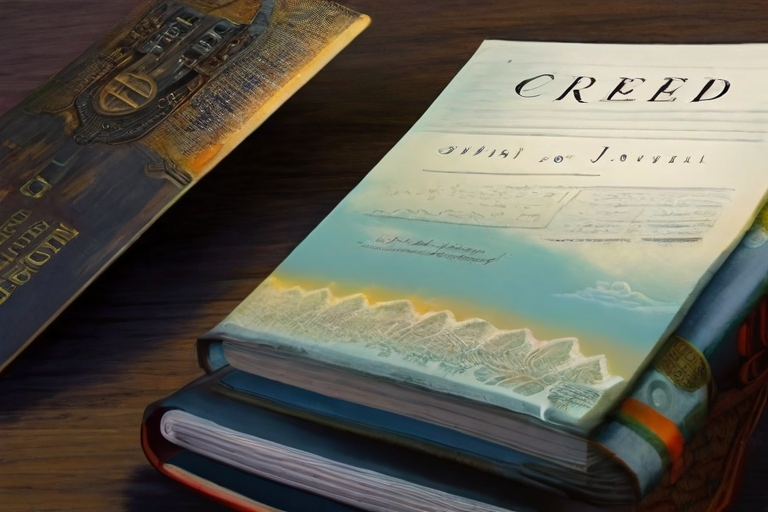

№ приглашения

дата

# Карта самоанализа (алкогольная)

1. Фамилия, имя, отчество `_________________________`
2. Число, месяц и год рождения `_________________________`
3. Специальность `_________________________`
4. Должность `_________________________`
5. Место работы `_________________________`
6. Состав семьи `_________________________`
7. Домашний адрес, телефон домашний, рабочий `_________________________`
8. Прямые родственники:

    <u>А</u>. курильщики `_________________________`
    
    <u>Б</u>. алкоголики `_________________________` 
9. Стаж употребления алкоголя `___` лет. Пили, но бросили. Стаж воздержания `___` лет. Указать причину и обстоятельства воздержания: лечение, личное убеждение, другие причины `_________________________`
10. Как часто вы употребляете спиртное: ежедневно, несколько раз в неделю, несколько раз в месяц? (подчеркнуть)
11. Как вы чувствуете себя и как ведете себя, если хотелось выпить, но не удалось? `_________________________`
12. Предпочитаемые алкогольные изделия `_________________________`, компании `_________________________`, ситуации `_________________________`
13. Самочувствие до, во время и после поглощения спиртного
14. **<u>Длительность запоев. Самочувствие во время них. Какой промежуток времени между запоями? Опишите наиболее сильный запой</u>**
15. **<u>Употребление одеколона, лосьона, политуры и т. п. Причины приема этих жидкостей, дозы и прочее</u>**
16. Обычные дозы потребления спиртного в настоящее время в течение одной выпивки `_________________________`
17. Обычная доза потребления спиртного в настоящее время за месяц `_________________________`
18. Среднемесячные расходы денег на алкогольные изделия `_________________________`
19. Среднемесячные расходы времени на приобретение алкогольных изделий `_________________________` (в часах)
20. Среднемесячные расходы времени непосредственно на сам процесс употребления спиртного `_________________________` (в часах)
21. **<u>Основные заболевания и травмы, перенесенные в прошлом</u>**
22. **<u>Заболевания и расстройства, приобретенные вследствие употребления спиртного: раздражительность, импотенция, настрит, панкреатит, стенокардия, ишемическая болезнь сердца и другие болезни `указать`</u>** `_________________________`
23. **<u>Укажите свой возраст когда:</u>**
    <u>А</u>. вы впервые увидели пьяного человека (ваш возраст `___` лет). Вспомните, кто это был (родственник, чужой человек). Опишите ситуацию, свои мысли и ощущения при этом
    
    <u>Б</u>. вы впервые увидели человека, употребляющего спиртное (ваш возраст `___` лет). Вспомните ситуацию и ваши мысли при этом. Кого вы увидели первым: пьяного или человека, пьющего алкоголь?
    
    <u>В</u>. вы впервые попробовали спиртное (ваш возраст `___` лет). Ощущения, ситуация. Отношение к спиртному тогда и сейчас
24. Стадия по лестнице Шичко:
    
    <u>А</u>. наличие программы `_________________________`
    
    <u>Б</u>. наличие приобщения `_________________________`
    
    <u>В</u>. наличие привычки `_________________________`
    
    <u>Г</u>. наличие потребности `_________________________`
    
    <u>Д</u>. моральная смерть `_________________________`
25. Число попыток освобождения от алкогольной зависимости:
    
    <u>А</u>. самостоятельно `_________________________`
    
    <u>Б</u>. по настоянию родных и близких `_________________________`
    
    <u>В</u>. под административным воздействием `_________________________`
    
    <u>Г</u>. путем лечения амбулаторно `_________________________`
    
    <u>Д</u>. ЛТП `_________________________`
26. Применявшиеся методы лечения: кодирование, гипноз, медикаментозное воздействие, другие методы (`указать`)
27. Число приводов:
    
    <u>А</u>. в вытрезвитель `_________________________`
    
    <u>Б</u>. в милицию `_________________________`
28. Количество наказаний за употребление алкоголя:

    <u>А</u>. административных `_________________________`
    
    <u>Б</u>. увольнений `_________________________`
    
    <u>В</u>. разводов `_________________________`
29. Кто из ваших родных и близких поддерживает вашу решимость по освобождению от алкогольной зависимости? `_________________________`
30. Подумайте, кому и почему выгодно ваше отравление алкогольными изделиями? `_________________________`
31. Причина прихода на занятия: добровольно, за компанию, под влиянием агитации, по принуждению (`подчеркнуть`)
32. **<u>Цель посещения занятий: полное освобождение, временное воздержание, уменьшение дозы, знакомство с методом, любопытство, другие причины (`указать`)</u>** `_________________________`
33. **<u>Ваше отношение к трезвенникам</u>** `_________________________`
34. **<u>Ваше понимание терминов «культурно пьющий», «умеренно пьющий», пьяница, алкоголик, трезвенник, «сухой закон», оценка «сухого закона»</u>**
35. К каким мерам по вашему мнению относится «сухой закон»: к «запретительным» или «разрешительным»? (`подчеркнуть`)
36. Степень желания освободиться от алкогольной зависимости: очень сильное, сильное, среднее, слабое, отсутствует (`подчеркнуть`)
37. Самочувствие в данный момент: сонливость, усталость, головная боль, недомогание, повышенная температура, плохое настроение, хорошее настроение (подчеркнуть)
    
    Дополнительные сведения о самочувствии `_________________________`
38. Болезни, от которых желаете избавиться `_________________________`
39. Вредные привычки, от которых желаете освободиться `_________________________`
40. Можете ли вы обойтись именно без этой сигареты?
41. Обязательно разыщите и запишите, что плохого вы нашли в отравлении табаком (слюна, горечь, кашел, слезы, жжение в желудке глупый вид и т. д.)

### Таблица табачных отравлений

| Время | Место и ситуация | Степень желания | Количество отравляющих вдохов | Возникающие ощущения |
|-------|------------------|-----------------|:------------------------------|:---------------------|
| `     ` | `                ` | `               ` | `                             ` | `                    ` |

